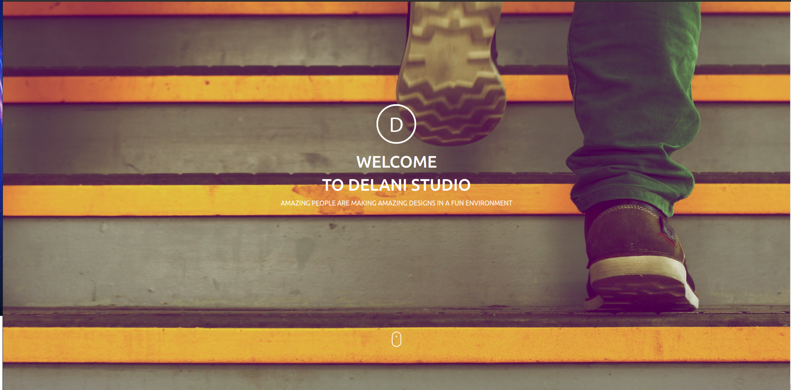

# DELANI STUDIO

#### Created on 17th April 2021
#### By Samuel Maingi Mutunga

## Description 

Delani Studio website is designed to help student familiarize with the jQuery and Bootstrap. They are implemented in the What we Do, Portfolio and Contact US. The Contact Us form enables users to send their messages and concerns to Delani Studios

The Application

---

## Access the website
Need the latest browser to be able to View

Follow this link https://layersony.github.io/delani-studio/

It is hosted by github.

---

### Setup
To access this project on your local files, you can clone it using these steps
1. Open your terminal
1. Use this command to clone `$ git clone https://github.com/layersony/delani-studio.git`
1. This will clone the repositoty into your local folder
1. Run `index.html` with active internet
1. __Enjoy :)__

---

## Behaviour Driven Development

1. Displays Form For Entering Date and Gender
   - INPUT: User Enters Name, Email and Message via 3 inputs
   - OUTPUT: User Name , We have received your message. Thank you for reaching out to us.'

1. Displays Form For Entering Date and Gender
   - INPUT: Click Submit without Entering any details
   - OUTPUT:  Please Do enter the required Details

2. Submit on Click
   - INPUT: Click to send
   - OUTPUT: Clears the Form Data

---

## Technologies Used
HTML

CSS

JAVASCRIPT

jQuery

BOOTSTRAP

Git

---

## Contact Details
sammaingi5@gmail.com

@Maingi `Slack Moringa`

Can View My Portfolio --> [Click_ME](https://layersony.github.io/portfolio/)

---

### License
This Project is under the [MIT](LICENCE) license

